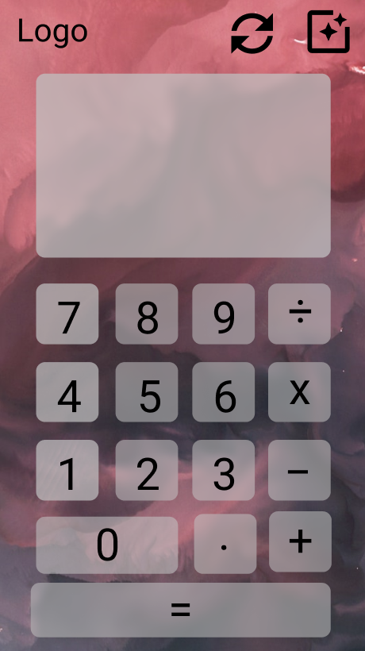

# Allan's Javascript Calculator

Hello, this is my javascript calculator project, I aim to use **HTML/SCSS, incorportating BEM conventions, and JS along with a mobile-first design approach**, to create a *responsive* and *aesthetic* web calculator app! 

## Prototype calculator design using Figma
https://www.figma.com/file/jejBRxPljSSllem9UDLfqq/Allan's-Javascript-Calculator?node-id=0%3A1

## More about this project
This calculator is a simple Javascript project which used on-screen keys to log numbers upon clicking. Each key is assigned an event listener for clicking. Series of numbers clicked appear in the calculator display. If the series of digits logged before an operator key are clicked, they were saved in   while the series of numbers pressed afterwards remained in . 

When the '=' button is pressed, a calculation function involving both numbers as input parameters is called, the specific calculation (multiplication, division, addition, subtraction) performed is selected via switch case based upon the operator saved in  . The refresh key resets all displays to empty so that new numbers can be saved for future calculations. 

Furthermore, I wanted to try making a button that changes the backgroud of the calculator, and so I made a procedure which selects random backgrounds from the image by assigning them to switch cases determined by Math.random().

## Future Improvements & Planned Bug Fixes
- Integration with the keyboard (currently, the user must click the on-screen buttons to use the calculator).
- Allowing for users to log and calculate with self-inputted negative numbers.
- Added backspace and percentage functionality.
- Optimisation of code for maximum efficiency and readability.

#### Thanks for reading!-Allan :)
